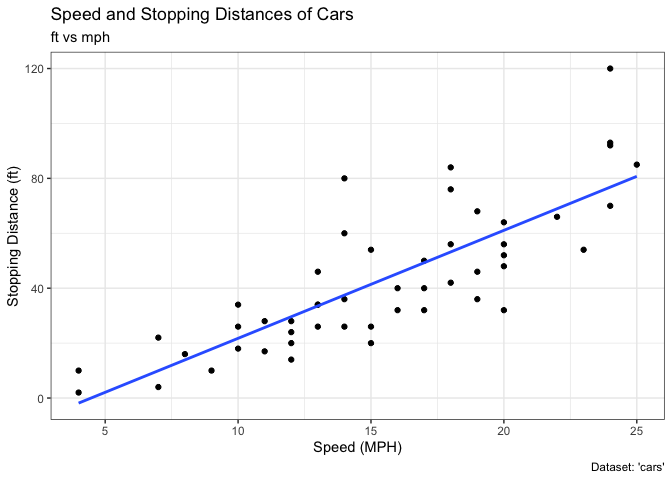
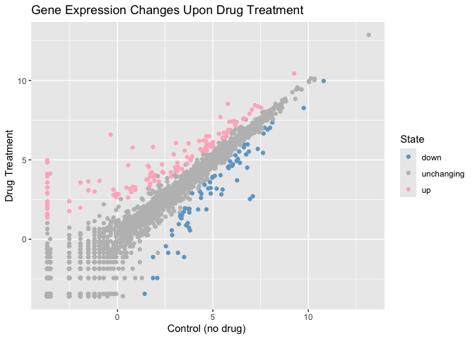
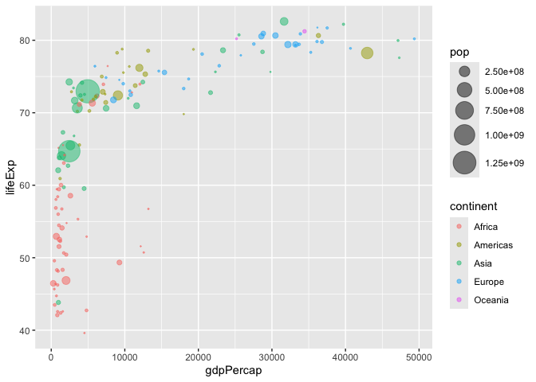
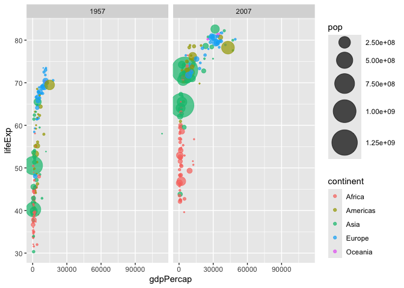
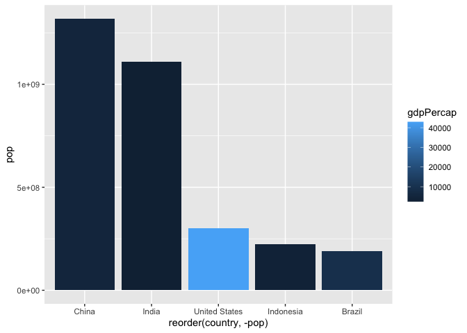
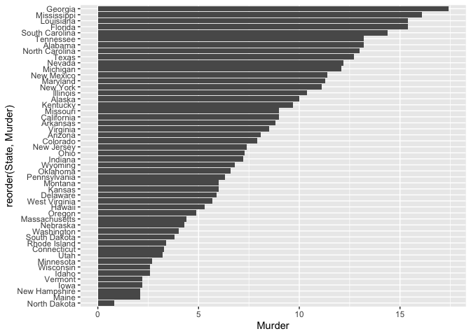
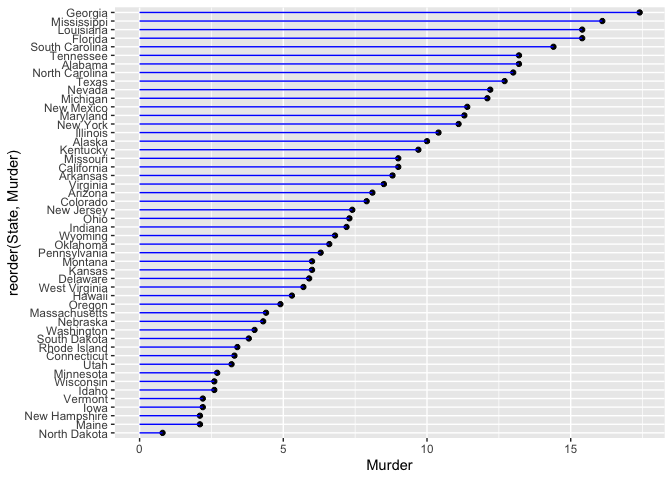
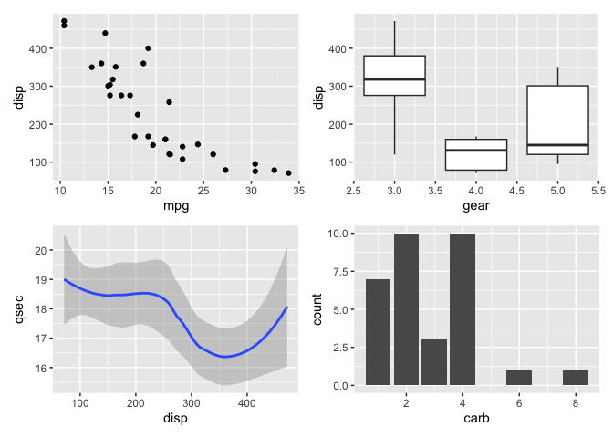

---
author:
- sylvia ho
authors:
- sylvia ho
title: "Class 05: Data Visualization with GGPLOT"
toc-title: Table of contents
---

## background

there are lots of ways to make plots in R these include so called base R
like the `plot()` and add packages like **ggplot2**

same plot diff sysyems use `cars`

:::: cell
``` {.r .cell-code}
head(cars)
```

::: {.cell-output .cell-output-stdout}
      speed dist
    1     4    2
    2     4   10
    3     7    4
    4     7   22
    5     8   16
    6     9   10
:::
::::

:::: cell
``` {.r .cell-code}
plot(cars)
```

::: cell-output-display

:::
::::

first instiall `install.packages("ggplot2")` \>**never run an install
packages in code chunk bc will re install every render** when use add-on
pkg need to load w `library()` every ggplot needs 3 things - data (eg
data frame) - aes (map data to plot) - geom (plot type, lines etc)

::::: cell
``` {.r .cell-code}
library(ggplot2)

#coment 

ggplot(cars) + 
  aes(x=speed, y=dist) +
  geom_point() +
  labs(title="Speed and Stopping Distances of Cars",
       x="Speed (MPH)", 
       y="Stopping Distance (ft)",
       subtitle = "ft vs mph",
       caption="Dataset: 'cars'") +
  geom_smooth(method="lm", se=FALSE) +
  theme_bw()
```

::: {.cell-output .cell-output-stderr}
    `geom_smooth()` using formula = 'y ~ x'
:::

::: cell-output-display

:::
:::::

aes

::::::::: cell
``` {.r .cell-code}
url <- "https://bioboot.github.io/bimm143_S20/class-material/up_down_expression.txt"
genes <- read.delim(url)
head(genes)
```

::: {.cell-output .cell-output-stdout}
            Gene Condition1 Condition2      State
    1      A4GNT -3.6808610 -3.4401355 unchanging
    2       AAAS  4.5479580  4.3864126 unchanging
    3      AASDH  3.7190695  3.4787276 unchanging
    4       AATF  5.0784720  5.0151916 unchanging
    5       AATK  0.4711421  0.5598642 unchanging
    6 AB015752.4 -3.6808610 -3.5921390 unchanging
:::

``` {.r .cell-code}
nrow(genes)
```

::: {.cell-output .cell-output-stdout}
    [1] 5196
:::

``` {.r .cell-code}
colnames (genes)
```

::: {.cell-output .cell-output-stdout}
    [1] "Gene"       "Condition1" "Condition2" "State"     
:::

``` {.r .cell-code}
ncol(genes)
```

::: {.cell-output .cell-output-stdout}
    [1] 4
:::

``` {.r .cell-code}
table(genes$State)
```

::: {.cell-output .cell-output-stdout}

          down unchanging         up 
            72       4997        127 
:::

``` {.r .cell-code}
127/5196
```

::: {.cell-output .cell-output-stdout}
    [1] 0.02444188
:::
:::::::::

plot

:::: cell
``` {.r .cell-code}
p <- ggplot(genes) + 
    aes(x=Condition1, y=Condition2, col=State) +
    geom_point()
p + scale_colour_manual(values=c("skyblue3","gray","pink1")) +
    labs(title="Gene Expression Changes Upon Drug Treatment",
         x="Control (no drug) ",
         y="Drug Treatment")
```

::: cell-output-display

:::
::::

gapminder install `install.packages("gapminder")`

::: cell
``` {.r .cell-code}
library(gapminder)
```
:::

-   dplyr *itals* **bold**

::::::: cell
``` {.r .cell-code}
# install.packages("dplyr")  ## un-comment to install if needed
library(dplyr)
```

::: {.cell-output .cell-output-stderr}

    Attaching package: 'dplyr'
:::

::: {.cell-output .cell-output-stderr}
    The following objects are masked from 'package:stats':

        filter, lag
:::

::: {.cell-output .cell-output-stderr}
    The following objects are masked from 'package:base':

        intersect, setdiff, setequal, union
:::

``` {.r .cell-code}
gapminder_2007 <- gapminder %>% filter(year==2007)

ggplot(gapminder_2007) +
  geom_point(aes(x=gdpPercap, y=lifeExp, color = continent, size = pop), alpha=.5) +
scale_size_area(max_size = 10)
```

::: cell-output-display

:::
:::::::

1957

:::: cell
``` {.r .cell-code}
gapminder_1957 <- gapminder %>% filter(year==1957 | year==2007)

ggplot(gapminder_1957) +
  geom_point(aes(x=gdpPercap, y=lifeExp, color = continent, size = pop), alpha=.7) +
scale_size_area(max_size = 15)+
  facet_wrap(~year)
```

::: cell-output-display

:::
::::

bars

::::: cell
``` {.r .cell-code}
gapminder_top5 <- gapminder %>% 
  filter(year==2007) %>% 
  arrange(desc(pop)) %>% 
  top_n(5, pop)

gapminder_top5
```

::: {.cell-output .cell-output-stdout}
    # A tibble: 5 × 6
      country       continent  year lifeExp        pop gdpPercap
      <fct>         <fct>     <int>   <dbl>      <int>     <dbl>
    1 China         Asia       2007    73.0 1318683096     4959.
    2 India         Asia       2007    64.7 1110396331     2452.
    3 United States Americas   2007    78.2  301139947    42952.
    4 Indonesia     Asia       2007    70.6  223547000     3541.
    5 Brazil        Americas   2007    72.4  190010647     9066.
:::

``` {.r .cell-code}
ggplot(gapminder_top5) +
  aes(x=reorder(country, -pop), y=pop, fill=gdpPercap) +
  geom_col()
```

::: cell-output-display

:::
:::::

::::: cell
``` {.r .cell-code}
USArrests$State <- rownames(USArrests)
ggplot(USArrests) +
  aes(x=reorder(State,Murder), y=Murder) +
  geom_col() +
  coord_flip()
```

::: cell-output-display

:::

``` {.r .cell-code}
ggplot(USArrests) +
  aes(x=reorder(State,Murder), y=Murder) +
  geom_point() +
  geom_segment(aes(x=State, 
                   xend=State, 
                   y=0, 
                   yend=Murder), color="blue") +
  coord_flip()
```

::: cell-output-display

:::
:::::

ani `install.packages("gifski")  install.packages("gganimate")`

:::: cell
``` {.r .cell-code}
library(gapminder)
library(gganimate)
"
# Setup nice regular ggplot of the gapminder data
ggplot(gapminder, aes(gdpPercap, lifeExp, size = pop, colour = country)) +
  geom_point(alpha = 0.7, show.legend = FALSE) +
  scale_colour_manual(values = country_colors) +
  scale_size(range = c(2, 12)) +
  scale_x_log10() +
  # Facet by continent
  facet_wrap(~continent) +
  # Here comes the gganimate specific bits
  labs(title = 'Year: {frame_time}', x = 'GDP per capita', y = 'life expectancy') +
  transition_time(year) +
  shadow_wake(wake_length = 0.1, alpha = FALSE)
  "
```

::: {.cell-output .cell-output-stdout}
    [1] "\n# Setup nice regular ggplot of the gapminder data\nggplot(gapminder, aes(gdpPercap, lifeExp, size = pop, colour = country)) +\n  geom_point(alpha = 0.7, show.legend = FALSE) +\n  scale_colour_manual(values = country_colors) +\n  scale_size(range = c(2, 12)) +\n  scale_x_log10() +\n  # Facet by continent\n  facet_wrap(~continent) +\n  # Here comes the gganimate specific bits\n  labs(title = 'Year: {frame_time}', x = 'GDP per capita', y = 'life expectancy') +\n  transition_time(year) +\n  shadow_wake(wake_length = 0.1, alpha = FALSE)\n  "
:::
::::

patchwork `install.packages("patchwork")`

::::: cell
``` {.r .cell-code}
library(patchwork)

# Setup some example plots 
p1 <- ggplot(mtcars) + geom_point(aes(mpg, disp))
p2 <- ggplot(mtcars) + geom_boxplot(aes(gear, disp, group = gear))
p3 <- ggplot(mtcars) + geom_smooth(aes(disp, qsec))
p4 <- ggplot(mtcars) + geom_bar(aes(carb))

# Use patchwork to combine them here:
(p1 | p2 ) /
     (p3|p4)
```

::: {.cell-output .cell-output-stderr}
    `geom_smooth()` using method = 'loess' and formula = 'y ~ x'
:::

::: cell-output-display

:::
:::::

:::: cell
``` {.r .cell-code}
sessionInfo()
```

::: {.cell-output .cell-output-stdout}
    R version 4.5.2 (2025-10-31)
    Platform: aarch64-apple-darwin20
    Running under: macOS Sequoia 15.7.3

    Matrix products: default
    BLAS:   /System/Library/Frameworks/Accelerate.framework/Versions/A/Frameworks/vecLib.framework/Versions/A/libBLAS.dylib 
    LAPACK: /Library/Frameworks/R.framework/Versions/4.5-arm64/Resources/lib/libRlapack.dylib;  LAPACK version 3.12.1

    locale:
    [1] en_US.UTF-8/en_US.UTF-8/en_US.UTF-8/C/en_US.UTF-8/en_US.UTF-8

    time zone: America/Los_Angeles
    tzcode source: internal

    attached base packages:
    [1] stats     graphics  grDevices utils     datasets  methods   base     

    other attached packages:
    [1] patchwork_1.3.2  gganimate_1.0.11 dplyr_1.1.4      gapminder_1.0.1 
    [5] ggplot2_4.0.1   

    loaded via a namespace (and not attached):
     [1] Matrix_1.7-4       gtable_0.3.6       jsonlite_2.0.0     crayon_1.5.3      
     [5] compiler_4.5.2     tidyselect_1.2.1   progress_1.2.3     splines_4.5.2     
     [9] scales_1.4.0       yaml_2.3.12        fastmap_1.2.0      lattice_0.22-7    
    [13] R6_2.6.1           labeling_0.4.3     generics_0.1.4     knitr_1.51        
    [17] tibble_3.3.1       pillar_1.11.1      RColorBrewer_1.1-3 rlang_1.1.7       
    [21] utf8_1.2.6         stringi_1.8.7      xfun_0.55          S7_0.2.1          
    [25] otel_0.2.0         cli_3.6.5          tweenr_2.0.3       withr_3.0.2       
    [29] magrittr_2.0.4     mgcv_1.9-3         digest_0.6.39      grid_4.5.2        
    [33] rstudioapi_0.18.0  hms_1.1.4          lifecycle_1.0.5    nlme_3.1-168      
    [37] prettyunits_1.2.0  vctrs_0.7.0        evaluate_1.0.5     glue_1.8.0        
    [41] farver_2.1.2       gifski_1.32.0-2    rmarkdown_2.30     tools_4.5.2       
    [45] pkgconfig_2.0.3    htmltools_0.5.9   
:::
::::
