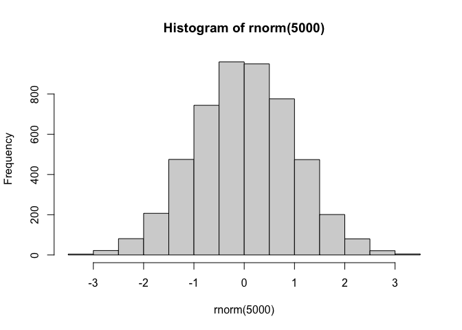
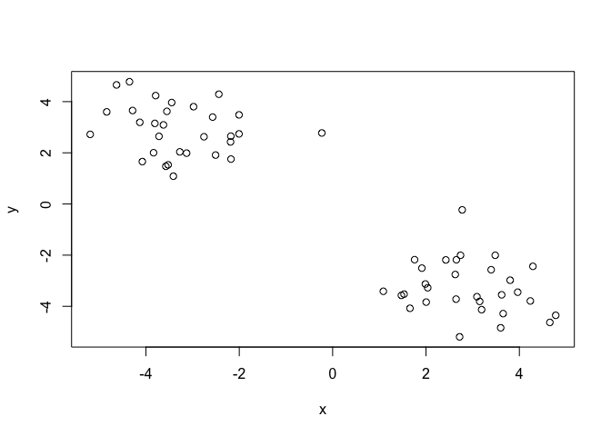
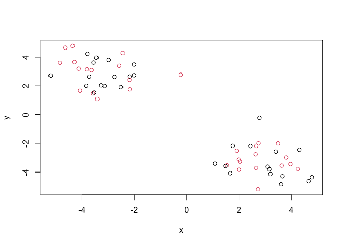
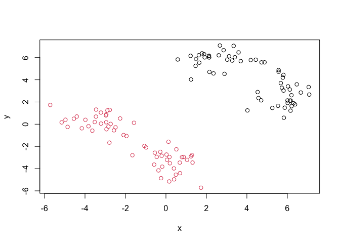
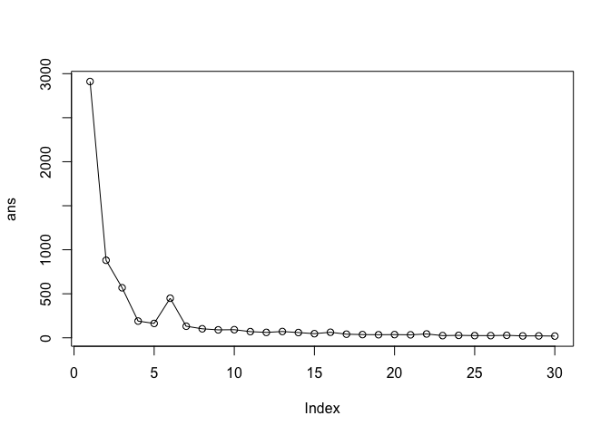
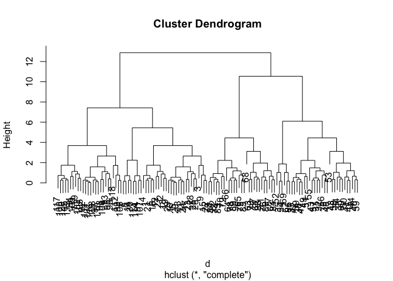
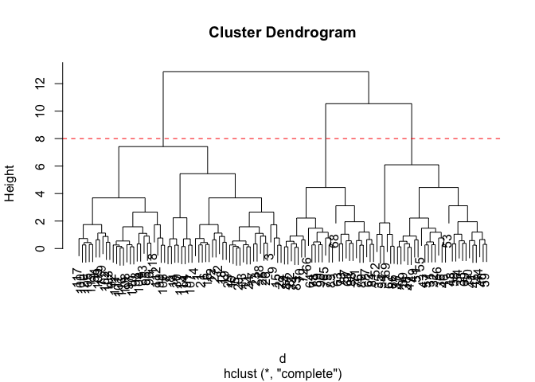
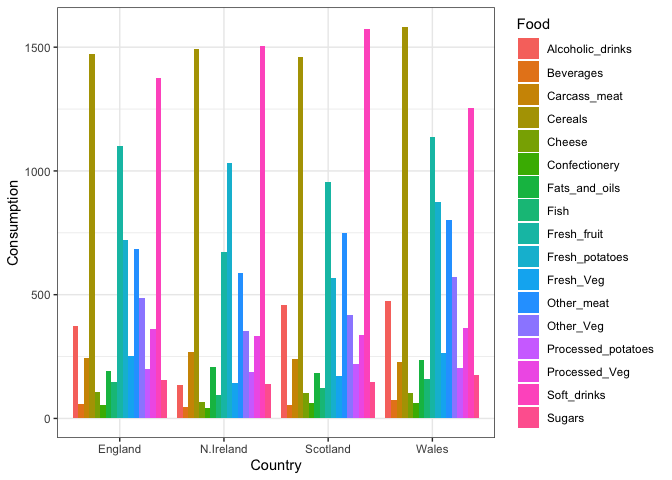
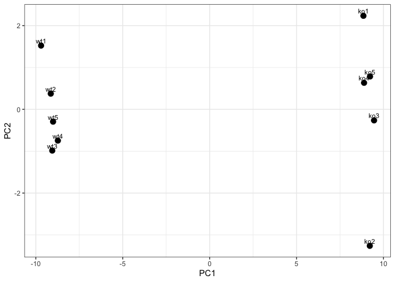
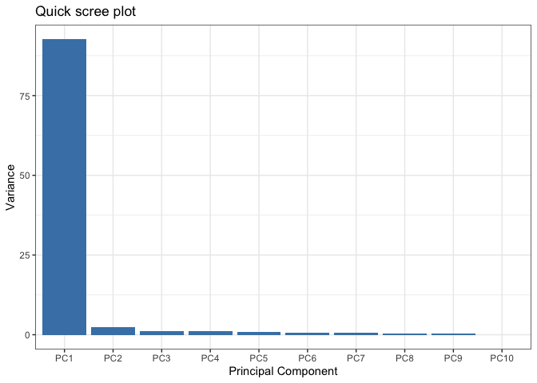

# class 7: machine learning
sylvia ho a18482382

##bg clustering, dimensionality reduction

##k means clustering “clusters” `rnorm()`

``` r
hist(rnorm(5000))
```



``` r
rnorm(30,mean=3)
```

     [1] 2.246534 3.499432 2.529098 1.293910 2.503010 1.693401 3.204889 2.355121
     [9] 1.035347 2.873356 4.360954 4.101304 3.094732 3.314121 4.256650 1.127470
    [17] 3.582229 1.690870 2.896412 2.210914 2.570592 1.182406 4.128920 3.071960
    [25] 3.511761 2.471098 3.354230 4.302958 2.474752 1.815228

``` r
tmp<- c(rnorm(30, mean = 3),
        rnorm(30, mean = -3))
x<-cbind(x=tmp, y=rev(tmp))
plot(x)
```



##k means clustering `kmeans()`

``` r
km<-kmeans(x, centers= 2)
```

``` r
km$size
```

    [1] 30 30

centers

``` r
km$centers
```

              x         y
    1  2.897788 -3.274364
    2 -3.274364  2.897788

membership

``` r
km$cluster
```

     [1] 1 1 1 1 1 1 1 1 1 1 1 1 1 1 1 1 1 1 1 1 1 1 1 1 1 1 1 1 1 1 2 2 2 2 2 2 2 2
    [39] 2 2 2 2 2 2 2 2 2 2 2 2 2 2 2 2 2 2 2 2 2 2

``` r
plot(x, col=c(1,2))
```



`kmeans()` 4 clusters and figure

``` r
tmp <- c(rnorm(30, mean = 3),
         rnorm(30, mean = -3),
         rnorm(30, mean = 0), 
         rnorm(30, mean = 6))
x <- cbind(x = tmp, y = rev(tmp))
k4 <- kmeans(x, centers = 2)
plot(x, col = k4$cluster)
```



``` r
km$tot.withinss
```

    [1] 119.505

``` r
k4$tot.withinss
```

    [1] 880.7848

``` r
ans<-NULL
for(i in 1:30){
ans <- c(ans, kmeans(x,centers = i)$tot.withinss)
}
```

``` r
plot(ans,typ="o")
```



**key pt** k means will impose clustering structure on ata even if not
there

##hierarchical clusteral main fn `hclust()` unlike kmeans (does allw ork
for u) hclust needs a “distance matrix” like returned from `dist()` fn
could be seq id, anything

``` r
d<-dist(x)
hc<-hclust(d)
plot(hc)
```



cut tree to uilt drp grps / branches to extract cluster membershp vector

``` r
plot(hc)
abline(h=8, col="red", lty=2)
```



``` r
cutree(hc,h=8)
```

      [1] 1 1 1 1 1 1 1 1 1 1 1 1 1 1 1 1 1 1 1 1 1 1 1 1 1 1 1 1 1 1 2 2 2 2 2 2 2
     [38] 2 2 2 2 2 2 2 2 2 2 2 2 2 2 2 2 2 2 2 2 2 2 2 3 3 3 3 3 3 2 3 2 3 3 3 3 3
     [75] 3 3 3 3 3 3 3 3 3 3 3 2 3 3 3 3 1 1 1 1 1 1 1 1 1 1 1 1 1 1 1 1 1 1 1 1 1
    [112] 1 1 1 1 1 1 1 1 1

## pca of uk food data

``` r
url <- "https://tinyurl.com/UK-foods"
x <- read.csv(url)
```

``` r
dim(x)
```

    [1] 17  5

``` r
rownames(x) <- x[,1]
x <- x[,-1]
head(x)
```

                   England Wales Scotland N.Ireland
    Cheese             105   103      103        66
    Carcass_meat       245   227      242       267
    Other_meat         685   803      750       586
    Fish               147   160      122        93
    Fats_and_oils      193   235      184       209
    Sugars             156   175      147       139

better read csv

``` r
x<-read.csv(url,row.names=1)
x
```

                        England Wales Scotland N.Ireland
    Cheese                  105   103      103        66
    Carcass_meat            245   227      242       267
    Other_meat              685   803      750       586
    Fish                    147   160      122        93
    Fats_and_oils           193   235      184       209
    Sugars                  156   175      147       139
    Fresh_potatoes          720   874      566      1033
    Fresh_Veg               253   265      171       143
    Other_Veg               488   570      418       355
    Processed_potatoes      198   203      220       187
    Processed_Veg           360   365      337       334
    Fresh_fruit            1102  1137      957       674
    Cereals                1472  1582     1462      1494
    Beverages                57    73       53        47
    Soft_drinks            1374  1256     1572      1506
    Alcoholic_drinks        375   475      458       135
    Confectionery            54    64       62        41

``` r
rainbow(4)
```

    [1] "#FF0000" "#80FF00" "#00FFFF" "#8000FF"

``` r
barplot(as.matrix(x), beside=T, col=rainbow(nrow(x)))
```


``` r
library(tidyr)

# Convert data to long format for ggplot with `pivot_longer()`
x_long <- x |> 
          tibble::rownames_to_column("Food") |> 
          pivot_longer(cols = -Food, 
                       names_to = "Country", 
                       values_to = "Consumption")

dim(x_long)
```

    [1] 68  3

``` r
library(ggplot2)
```

``` r
ggplot(x_long) +
  aes(x = Country, y = Consumption, fill = Food) +
  geom_col(position = "dodge") +
  theme_bw()
```



``` r
pairs(x, col=rainbow(nrow(x)), pch=16)
```


``` r
library(pheatmap)

pheatmap( as.matrix(x) )
```


main pca fn in base r is `prcomp()` fn wants transpose of food data
asinput (food as cols and countries as rows)

``` r
pca <- prcomp( t(x) )
summary(pca)
```

    Importance of components:
                                PC1      PC2      PC3     PC4
    Standard deviation     324.1502 212.7478 73.87622 2.7e-14
    Proportion of Variance   0.6744   0.2905  0.03503 0.0e+00
    Cumulative Proportion    0.6744   0.9650  1.00000 1.0e+00

`pca$x` scores along w new pcs, called pc plot or score plot, ordination
plot

``` r
df <- as.data.frame(pca$x)
df$Country <- rownames(df)

ggplot(pca$x) +
  aes(x = PC1, y = PC2, label = rownames(pca$x)) +
  geom_point(size = 3) +
  geom_text(vjust = -0.5) +
  xlim(-270, 500) +
  xlab("PC1") +
  ylab("PC2") +
  theme_bw()
```


``` r
v <- round( pca$sdev^2/sum(pca$sdev^2) * 100 )
v
```

    [1] 67 29  4  0

``` r
attributes(pca)
```

    $names
    [1] "sdev"     "rotation" "center"   "scale"    "x"       

    $class
    [1] "prcomp"

loadings plot

``` r
ggplot(pca$rotation) +
  aes(x = PC1, 
      y = reorder(rownames(pca$rotation), PC1)) +
  geom_col(fill = "steelblue") +
  xlab("PC1 Loading Score") +
  ylab("") +
  theme_bw() +
  theme(axis.text.y = element_text(size = 9))
```


``` r
url2 <- "https://tinyurl.com/expression-CSV"
rna.data <- read.csv(url2, row.names=1)
head(rna.data)
```

           wt1 wt2  wt3  wt4 wt5 ko1 ko2 ko3 ko4 ko5
    gene1  439 458  408  429 420  90  88  86  90  93
    gene2  219 200  204  210 187 427 423 434 433 426
    gene3 1006 989 1030 1017 973 252 237 238 226 210
    gene4  783 792  829  856 760 849 856 835 885 894
    gene5  181 249  204  244 225 277 305 272 270 279
    gene6  460 502  491  491 493 612 594 577 618 638

``` r
pca <- prcomp(t(rna.data), scale=TRUE)

# Create data frame for plotting
df <- as.data.frame(pca$x)
df$Sample <- rownames(df)

## Plot with ggplot
ggplot(df) +
  aes(x = PC1, y = PC2, label = Sample) +
  geom_point(size = 3) +
  geom_text(vjust = -0.5, size = 3) +
  xlab("PC1") +
  ylab("PC2") +
  theme_bw()
```



``` r
summary(pca)
```

    Importance of components:
                              PC1    PC2     PC3     PC4     PC5     PC6     PC7
    Standard deviation     9.6237 1.5198 1.05787 1.05203 0.88062 0.82545 0.80111
    Proportion of Variance 0.9262 0.0231 0.01119 0.01107 0.00775 0.00681 0.00642
    Cumulative Proportion  0.9262 0.9493 0.96045 0.97152 0.97928 0.98609 0.99251
                               PC8     PC9     PC10
    Standard deviation     0.62065 0.60342 3.39e-15
    Proportion of Variance 0.00385 0.00364 0.00e+00
    Cumulative Proportion  0.99636 1.00000 1.00e+00

percent var

``` r
pca.var <- pca$sdev^2
pca.var.per <- round(pca.var/sum(pca.var)*100, 1)

# Create scree plot data
scree_df <- data.frame(
  PC = factor(paste0("PC", 1:10), levels = paste0("PC", 1:10)),
  Variance = pca.var[1:10]
)

ggplot(scree_df) +
  aes(x = PC, y = Variance) +
  geom_col(fill = "steelblue") +
  ggtitle("Quick scree plot") +
  xlab("Principal Component") +
  ylab("Variance") +
  theme_bw()
```



``` r
scree_pct_df <- data.frame(
  PC = factor(paste0("PC", 1:10), levels = paste0("PC", 1:10)),
  PercentVariation = pca.var.per[1:10]
)

ggplot(scree_pct_df) +
  aes(x = PC, y = PercentVariation) +
  geom_col(fill = "steelblue") +
  ggtitle("Scree Plot") +
  xlab("Principal Component") +
  ylab("Percent Variation") +
  theme_bw()
```


``` r
colvec <- colnames(rna.data)
colvec[grep("wt", colvec)] <- "red"
colvec[grep("ko", colvec)] <- "blue"

# Add condition to data frame
df$condition <- substr(df$Sample, 1, 2)
df$color <- colvec

ggplot(df) +
  aes(x = PC1, y = PC2, color = color, label = Sample) +
  geom_point(size = 3) +
  geom_text(vjust = -0.5, hjust = 0.5, show.legend = FALSE) +
  scale_color_identity() +
  xlab(paste0("PC1 (", pca.var.per[1], "%)")) +
  ylab(paste0("PC2 (", pca.var.per[2], "%)")) +
  theme_bw()
```


