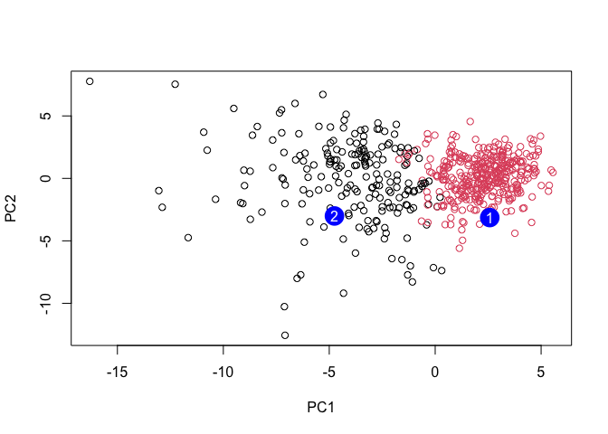

---
author:
- sylvia ho a18482382
authors:
- sylvia ho a18482382
title: class8miniproj
toc-title: Table of contents
---

-   [combo methods](#combo-methods){#toc-combo-methods}
-   [prediction](#prediction){#toc-prediction}

##Background all techniques so far data analysis: ml clustering, pca to
analyze real bc biopsy

##data import data in csv

::: cell
``` {.r .cell-code}
fna.data<-read.csv("WisconsinCancer.csv")
wisc.df <- data.frame(fna.data, row.names=1)
```
:::

:::: cell
``` {.r .cell-code}
head(wisc.df, 4)
```

::: {.cell-output .cell-output-stdout}
             diagnosis radius_mean texture_mean perimeter_mean area_mean
    842302           M       17.99        10.38         122.80    1001.0
    842517           M       20.57        17.77         132.90    1326.0
    84300903         M       19.69        21.25         130.00    1203.0
    84348301         M       11.42        20.38          77.58     386.1
             smoothness_mean compactness_mean concavity_mean concave.points_mean
    842302           0.11840          0.27760         0.3001             0.14710
    842517           0.08474          0.07864         0.0869             0.07017
    84300903         0.10960          0.15990         0.1974             0.12790
    84348301         0.14250          0.28390         0.2414             0.10520
             symmetry_mean fractal_dimension_mean radius_se texture_se perimeter_se
    842302          0.2419                0.07871    1.0950     0.9053        8.589
    842517          0.1812                0.05667    0.5435     0.7339        3.398
    84300903        0.2069                0.05999    0.7456     0.7869        4.585
    84348301        0.2597                0.09744    0.4956     1.1560        3.445
             area_se smoothness_se compactness_se concavity_se concave.points_se
    842302    153.40      0.006399        0.04904      0.05373           0.01587
    842517     74.08      0.005225        0.01308      0.01860           0.01340
    84300903   94.03      0.006150        0.04006      0.03832           0.02058
    84348301   27.23      0.009110        0.07458      0.05661           0.01867
             symmetry_se fractal_dimension_se radius_worst texture_worst
    842302       0.03003             0.006193        25.38         17.33
    842517       0.01389             0.003532        24.99         23.41
    84300903     0.02250             0.004571        23.57         25.53
    84348301     0.05963             0.009208        14.91         26.50
             perimeter_worst area_worst smoothness_worst compactness_worst
    842302            184.60     2019.0           0.1622            0.6656
    842517            158.80     1956.0           0.1238            0.1866
    84300903          152.50     1709.0           0.1444            0.4245
    84348301           98.87      567.7           0.2098            0.8663
             concavity_worst concave.points_worst symmetry_worst
    842302            0.7119               0.2654         0.4601
    842517            0.2416               0.1860         0.2750
    84300903          0.4504               0.2430         0.3613
    84348301          0.6869               0.2575         0.6638
             fractal_dimension_worst
    842302                   0.11890
    842517                   0.08902
    84300903                 0.08758
    84348301                 0.17300
:::
::::

::: cell
``` {.r .cell-code}
#remove col1
wisc.data <- wisc.df[,-1]
```
:::

::: cell
``` {.r .cell-code}
diagnosis <- wisc.df$diagnosis
```
:::

> q1: 569

:::: cell
``` {.r .cell-code}
nrow(wisc.data)
```

::: {.cell-output .cell-output-stdout}
    [1] 569
:::
::::

> q2: 212

:::: cell
``` {.r .cell-code}
sum(diagnosis=="M")
```

::: {.cell-output .cell-output-stdout}
    [1] 212
:::
::::

> q3: 10

:::: cell
``` {.r .cell-code}
length(grep("mean", colnames(wisc.df)))
```

::: {.cell-output .cell-output-stdout}
    [1] 10
:::
::::

##pca opt arg `scale=TRUE` since cols/ft/dimensions are diff scales

::::: cell
``` {.r .cell-code}
colMeans(wisc.data)
```

::: {.cell-output .cell-output-stdout}
                radius_mean            texture_mean          perimeter_mean 
               1.412729e+01            1.928965e+01            9.196903e+01 
                  area_mean         smoothness_mean        compactness_mean 
               6.548891e+02            9.636028e-02            1.043410e-01 
             concavity_mean     concave.points_mean           symmetry_mean 
               8.879932e-02            4.891915e-02            1.811619e-01 
     fractal_dimension_mean               radius_se              texture_se 
               6.279761e-02            4.051721e-01            1.216853e+00 
               perimeter_se                 area_se           smoothness_se 
               2.866059e+00            4.033708e+01            7.040979e-03 
             compactness_se            concavity_se       concave.points_se 
               2.547814e-02            3.189372e-02            1.179614e-02 
                symmetry_se    fractal_dimension_se            radius_worst 
               2.054230e-02            3.794904e-03            1.626919e+01 
              texture_worst         perimeter_worst              area_worst 
               2.567722e+01            1.072612e+02            8.805831e+02 
           smoothness_worst       compactness_worst         concavity_worst 
               1.323686e-01            2.542650e-01            2.721885e-01 
       concave.points_worst          symmetry_worst fractal_dimension_worst 
               1.146062e-01            2.900756e-01            8.394582e-02 
:::

``` {.r .cell-code}
apply(wisc.data,2,sd)
```

::: {.cell-output .cell-output-stdout}
                radius_mean            texture_mean          perimeter_mean 
               3.524049e+00            4.301036e+00            2.429898e+01 
                  area_mean         smoothness_mean        compactness_mean 
               3.519141e+02            1.406413e-02            5.281276e-02 
             concavity_mean     concave.points_mean           symmetry_mean 
               7.971981e-02            3.880284e-02            2.741428e-02 
     fractal_dimension_mean               radius_se              texture_se 
               7.060363e-03            2.773127e-01            5.516484e-01 
               perimeter_se                 area_se           smoothness_se 
               2.021855e+00            4.549101e+01            3.002518e-03 
             compactness_se            concavity_se       concave.points_se 
               1.790818e-02            3.018606e-02            6.170285e-03 
                symmetry_se    fractal_dimension_se            radius_worst 
               8.266372e-03            2.646071e-03            4.833242e+00 
              texture_worst         perimeter_worst              area_worst 
               6.146258e+00            3.360254e+01            5.693570e+02 
           smoothness_worst       compactness_worst         concavity_worst 
               2.283243e-02            1.573365e-01            2.086243e-01 
       concave.points_worst          symmetry_worst fractal_dimension_worst 
               6.573234e-02            6.186747e-02            1.806127e-02 
:::
:::::

> q4 44.27%

:::: cell
``` {.r .cell-code}
wisc.pr <- prcomp( wisc.data, scale = T)
summary(wisc.pr)
```

::: {.cell-output .cell-output-stdout}
    Importance of components:
                              PC1    PC2     PC3     PC4     PC5     PC6     PC7
    Standard deviation     3.6444 2.3857 1.67867 1.40735 1.28403 1.09880 0.82172
    Proportion of Variance 0.4427 0.1897 0.09393 0.06602 0.05496 0.04025 0.02251
    Cumulative Proportion  0.4427 0.6324 0.72636 0.79239 0.84734 0.88759 0.91010
                               PC8    PC9    PC10   PC11    PC12    PC13    PC14
    Standard deviation     0.69037 0.6457 0.59219 0.5421 0.51104 0.49128 0.39624
    Proportion of Variance 0.01589 0.0139 0.01169 0.0098 0.00871 0.00805 0.00523
    Cumulative Proportion  0.92598 0.9399 0.95157 0.9614 0.97007 0.97812 0.98335
                              PC15    PC16    PC17    PC18    PC19    PC20   PC21
    Standard deviation     0.30681 0.28260 0.24372 0.22939 0.22244 0.17652 0.1731
    Proportion of Variance 0.00314 0.00266 0.00198 0.00175 0.00165 0.00104 0.0010
    Cumulative Proportion  0.98649 0.98915 0.99113 0.99288 0.99453 0.99557 0.9966
                              PC22    PC23   PC24    PC25    PC26    PC27    PC28
    Standard deviation     0.16565 0.15602 0.1344 0.12442 0.09043 0.08307 0.03987
    Proportion of Variance 0.00091 0.00081 0.0006 0.00052 0.00027 0.00023 0.00005
    Cumulative Proportion  0.99749 0.99830 0.9989 0.99942 0.99969 0.99992 0.99997
                              PC29    PC30
    Standard deviation     0.02736 0.01153
    Proportion of Variance 0.00002 0.00000
    Cumulative Proportion  1.00000 1.00000
:::
::::

> q5 3

> q6 more than 5

> q7: it is difficult to understand and the thing that stands out is the
> red and black

:::: cell
``` {.r .cell-code}
biplot(wisc.pr)
```

::: cell-output-display

:::
::::

:::: cell
``` {.r .cell-code}
library(ggplot2)

ggplot(wisc.pr$x) +
  aes(x=PC1, y=PC2, col=diagnosis) +
  geom_point()
```

::: cell-output-display

:::
::::

> q8 pc1 is showing separation b/m

:::: cell
``` {.r .cell-code}
library(ggplot2)

ggplot(wisc.pr$x) +
  aes(x=PC1, y=PC3, col=diagnosis) +
  geom_point()
```

::: cell-output-display

:::
::::

::::: cell
``` {.r .cell-code}
pr.var <- wisc.pr$sdev^2
head(pr.var)
```

::: {.cell-output .cell-output-stdout}
    [1] 13.281608  5.691355  2.817949  1.980640  1.648731  1.207357
:::

``` {.r .cell-code}
pve <- pr.var / sum(pr.var)

# Plot variance explained for each principal component
plot(c(1,pve), xlab = "Principal Component", 
     ylab = "Proportion of Variance Explained", 
     ylim = c(0, 1), type = "o")
```

::: cell-output-display

:::
:::::

> q9 large. concavity_mean, perimeter_mean

:::: cell
``` {.r .cell-code}
wisc.pr$rotation[,1]
```

::: {.cell-output .cell-output-stdout}
                radius_mean            texture_mean          perimeter_mean 
                -0.21890244             -0.10372458             -0.22753729 
                  area_mean         smoothness_mean        compactness_mean 
                -0.22099499             -0.14258969             -0.23928535 
             concavity_mean     concave.points_mean           symmetry_mean 
                -0.25840048             -0.26085376             -0.13816696 
     fractal_dimension_mean               radius_se              texture_se 
                -0.06436335             -0.20597878             -0.01742803 
               perimeter_se                 area_se           smoothness_se 
                -0.21132592             -0.20286964             -0.01453145 
             compactness_se            concavity_se       concave.points_se 
                -0.17039345             -0.15358979             -0.18341740 
                symmetry_se    fractal_dimension_se            radius_worst 
                -0.04249842             -0.10256832             -0.22799663 
              texture_worst         perimeter_worst              area_worst 
                -0.10446933             -0.23663968             -0.22487053 
           smoothness_worst       compactness_worst         concavity_worst 
                -0.12795256             -0.21009588             -0.22876753 
       concave.points_worst          symmetry_worst fractal_dimension_worst 
                -0.25088597             -0.12290456             -0.13178394 
:::
::::

##hierarchical clustering obv grps into m/b ? scale `wisc.data` then
calc dist matrix, pass to `hclust()`

First scale the wisc.data data and assign the result to data.scaled.

::: cell
``` {.r .cell-code}
# Scale the wisc.data data using the "scale()" function
data.scaled <- scale(wisc.data)
```
:::

Next, calculate the (Euclidean) distances between all pairs of
observations in the new scaled dataset and assign the result to
data.dist.

::: cell
``` {.r .cell-code}
data.dist <- dist(data.scaled)
```
:::

Create a hierarchical clustering model using complete linkage. Manually
specify the method argument to hclust() and assign the results to
wisc.hclust.

::: cell
``` {.r .cell-code}
wisc.hclust <- hclust(data.dist, method = "complete")
```
:::

> q10 19

:::: cell
``` {.r .cell-code}
plot(wisc.hclust)
abline(h = 19, col = "red", lty = 2)
```

::: cell-output-display

:::
::::

:::: cell
``` {.r .cell-code}
wisc.hclust.clusters <- cutree(wisc.hclust, k=4)

#We can use the table() function to compare the cluster membership to the actual diagnoses.

table(wisc.hclust.clusters, diagnosis)
```

::: {.cell-output .cell-output-stdout}
                        diagnosis
    wisc.hclust.clusters   B   M
                       1  12 165
                       2   2   5
                       3 343  40
                       4   0   2
:::
::::

## combo methods

new vars (pcs) `wisc.pr$x` that are better descriptors of data set than
orgi ie 30 cols in `wisc.data` and use as basis for clustering

> q12 Side-note: The method="ward.D2"creates groups such that variance
> is minimized within clusters. This has the effect of looking for
> spherical clusters with the process starting with all points in
> individual clusters (bottom up) and then repeatedly merging a pair of
> clusters such that when merged there is a minimum increase in total
> within-cluster variance. This process continues until a single group
> including all points (the top of the tree) is defined.

:::: cell
``` {.r .cell-code}
pc.dist<- dist(wisc.pr$x[,1:3])
wisc.pr.hclust<-hclust(pc.dist, method = "ward.D2")
plot(wisc.pr.hclust)
```

::: cell-output-display

:::
::::

:::: cell
``` {.r .cell-code}
grps <- cutree(wisc.pr.hclust, k=2)
table(grps)
```

::: {.cell-output .cell-output-stdout}
    grps
      1   2 
    203 366 
:::
::::

can run `table()` w both clustering `grps` and expert `diagnosis`

:::: cell
``` {.r .cell-code}
table(grps, diagnosis)
```

::: {.cell-output .cell-output-stdout}
        diagnosis
    grps   B   M
       1  24 179
       2 333  33
:::
::::

c1 has 179m, c2 has 333 b aka

-   179 tp
-   24 fp
-   333 tn
-   33 fn

:::: cell
``` {.r .cell-code}
ggplot(wisc.pr$x) +
  aes(PC1, PC2) +
  geom_point(col=grps)
```

::: cell-output-display

:::
::::

::: cell
``` {.r .cell-code}
wisc.pr.hclust <- hclust(dist(wisc.pr$x[, 1:7]), method = "ward.D2")
wisc.pr.hclust.clusters <- cutree(wisc.pr.hclust, k=2)
```
:::

> q13 better but its still pretty high

:::: cell
``` {.r .cell-code}
# Compare to actual diagnoses
table(wisc.pr.hclust.clusters, diagnosis)
```

::: {.cell-output .cell-output-stdout}
                           diagnosis
    wisc.pr.hclust.clusters   B   M
                          1  28 188
                          2 329  24
:::
::::

> q14 c1m c3b, pretty good

:::: cell
``` {.r .cell-code}
table(wisc.hclust.clusters, diagnosis)
```

::: {.cell-output .cell-output-stdout}
                        diagnosis
    wisc.hclust.clusters   B   M
                       1  12 165
                       2   2   5
                       3 343  40
                       4   0   2
:::
::::

sensitivity TP/(TP+FN) spec: TN/(TN+FP)

::::: cell
``` {.r .cell-code}
tp<- 179
fp<- 24
tn<- 333
fn<- 33
sen<-tp/(tp+fn)
spec<-tn/(tn+fp)
sen
```

::: {.cell-output .cell-output-stdout}
    [1] 0.8443396
:::

``` {.r .cell-code}
spec
```

::: {.cell-output .cell-output-stdout}
    [1] 0.9327731
:::
:::::

## prediction

can use model for new cases

:::: cell
``` {.r .cell-code}
#url <- "new_samples.csv"
url <- "https://tinyurl.com/new-samples-CSV"
new <- read.csv(url)
npc <- predict(wisc.pr, newdata=new)
npc
```

::: {.cell-output .cell-output-stdout}
               PC1       PC2        PC3        PC4       PC5        PC6        PC7
    [1,]  2.576616 -3.135913  1.3990492 -0.7631950  2.781648 -0.8150185 -0.3959098
    [2,] -4.754928 -3.009033 -0.1660946 -0.6052952 -1.140698 -1.2189945  0.8193031
                PC8       PC9       PC10      PC11      PC12      PC13     PC14
    [1,] -0.2307350 0.1029569 -0.9272861 0.3411457  0.375921 0.1610764 1.187882
    [2,] -0.3307423 0.5281896 -0.4855301 0.7173233 -1.185917 0.5893856 0.303029
              PC15       PC16        PC17        PC18        PC19       PC20
    [1,] 0.3216974 -0.1743616 -0.07875393 -0.11207028 -0.08802955 -0.2495216
    [2,] 0.1299153  0.1448061 -0.40509706  0.06565549  0.25591230 -0.4289500
               PC21       PC22       PC23       PC24        PC25         PC26
    [1,]  0.1228233 0.09358453 0.08347651  0.1223396  0.02124121  0.078884581
    [2,] -0.1224776 0.01732146 0.06316631 -0.2338618 -0.20755948 -0.009833238
                 PC27        PC28         PC29         PC30
    [1,]  0.220199544 -0.02946023 -0.015620933  0.005269029
    [2,] -0.001134152  0.09638361  0.002795349 -0.019015820
:::
::::

:::: cell
``` {.r .cell-code}
plot(wisc.pr$x[,1:2], col=grps)
points(npc[,1], npc[,2], col="blue", pch=16, cex=3)
text(npc[,1], npc[,2], c(1,2), col="white")
```

::: cell-output-display

:::
::::

> q16 pt 1

:::: cell
``` {.r .cell-code}
sessionInfo()
```

::: {.cell-output .cell-output-stdout}
    R version 4.5.2 (2025-10-31)
    Platform: aarch64-apple-darwin20
    Running under: macOS Sequoia 15.7.3

    Matrix products: default
    BLAS:   /System/Library/Frameworks/Accelerate.framework/Versions/A/Frameworks/vecLib.framework/Versions/A/libBLAS.dylib 
    LAPACK: /Library/Frameworks/R.framework/Versions/4.5-arm64/Resources/lib/libRlapack.dylib;  LAPACK version 3.12.1

    locale:
    [1] en_US.UTF-8/en_US.UTF-8/en_US.UTF-8/C/en_US.UTF-8/en_US.UTF-8

    time zone: America/Los_Angeles
    tzcode source: internal

    attached base packages:
    [1] stats     graphics  grDevices utils     datasets  methods   base     

    other attached packages:
    [1] ggplot2_4.0.1

    loaded via a namespace (and not attached):
     [1] vctrs_0.7.0        cli_3.6.5          knitr_1.51         rlang_1.1.7       
     [5] xfun_0.55          otel_0.2.0         generics_0.1.4     S7_0.2.1          
     [9] jsonlite_2.0.0     labeling_0.4.3     glue_1.8.0         htmltools_0.5.9   
    [13] scales_1.4.0       rmarkdown_2.30     grid_4.5.2         tibble_3.3.1      
    [17] evaluate_1.0.5     fastmap_1.2.0      yaml_2.3.12        lifecycle_1.0.5   
    [21] compiler_4.5.2     dplyr_1.1.4        RColorBrewer_1.1-3 pkgconfig_2.0.3   
    [25] rstudioapi_0.18.0  farver_2.1.2       digest_0.6.39      R6_2.6.1          
    [29] tidyselect_1.2.1   pillar_1.11.1      magrittr_2.0.4     withr_3.0.2       
    [33] tools_4.5.2        gtable_0.3.6      
:::
::::
