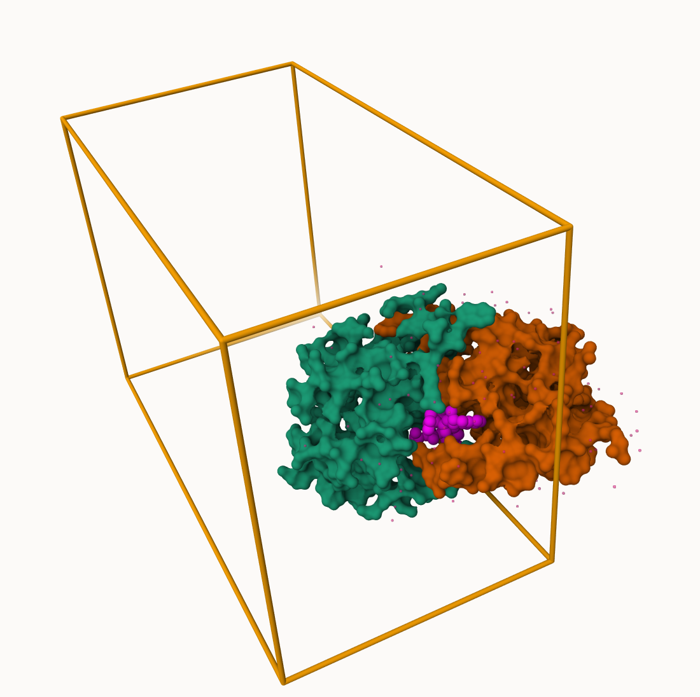
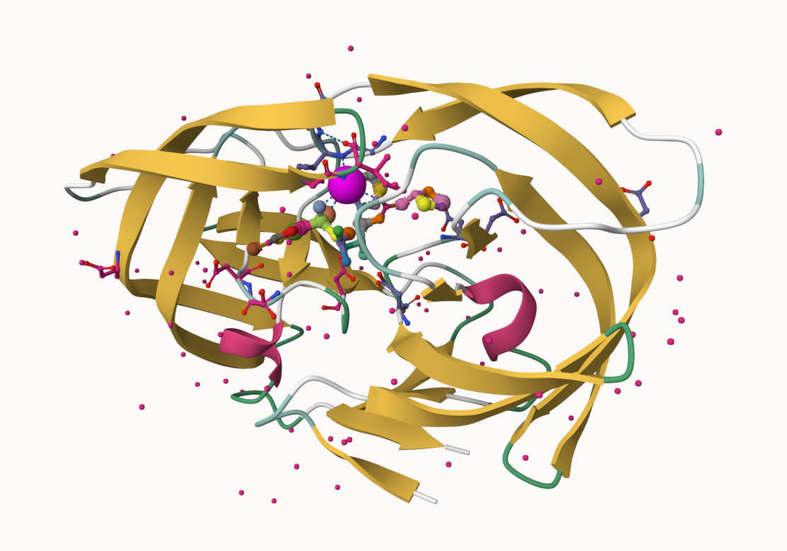

---
author:
- Sylvia ho a18482382
authors:
- Sylvia ho a18482382
title: class10 structural bioinf pt1
toc-title: Table of contents
---

# pdb database

[prothein data bank](http://www.rcsb.org/) is main repo of biomol
structure data \>q1 81, 13 % in pdb solved by x ray and em

> q2 1

::: cell
``` {.r .cell-code}
stats<- read.csv(url("https://tinyurl.com/pdbstats26"))
stat<- data.frame(stats)
```
:::

:::: cell
``` {.r .cell-code}
df <- stat[, -1]

n.sums<-colSums(df)
n<- n.sums/n.sums["Total"]
round(n, digits = 2)
```

::: {.cell-output .cell-output-stdout}
               X.ray               EM              NMR      Integrative 
                0.81             0.13             0.06             0.00 
    Multiple.methods          Neutron            Other            Total 
                0.00             0.00             0.00             1.00 
:::
::::

> q3 1,173

## [molstar](https://molstar.org/viewer/)



> Q4: Water molecules normally have 3 atoms. Why do we see just one atom
> per water molecule in this structure? microscopy detected es not full
> nuclei

> Q5: There is a critical "conserved" water molecule in the binding
> site. Can you identify this water molecule? What residue number does
> this water molecule have 1552



> q6 gen img hiv pr cartoon colored by secondary strcuture, showing
> inhibitor (lignad) ball and stick

> q7 the asps at the secondary site, the loops on both sides

##bio3d

::::: cell
``` {.r .cell-code}
library (bio3d)
hiv <- read.pdb("1hsg")
```

::: {.cell-output .cell-output-stdout}
      Note: Accessing on-line PDB file
:::

``` {.r .cell-code}
hiv
```

::: {.cell-output .cell-output-stdout}

     Call:  read.pdb(file = "1hsg")

       Total Models#: 1
         Total Atoms#: 1686,  XYZs#: 5058  Chains#: 2  (values: A B)

         Protein Atoms#: 1514  (residues/Calpha atoms#: 198)
         Nucleic acid Atoms#: 0  (residues/phosphate atoms#: 0)

         Non-protein/nucleic Atoms#: 172  (residues: 128)
         Non-protein/nucleic resid values: [ HOH (127), MK1 (1) ]

       Protein sequence:
          PQITLWQRPLVTIKIGGQLKEALLDTGADDTVLEEMSLPGRWKPKMIGGIGGFIKVRQYD
          QILIEICGHKAIGTVLVGPTPVNIIGRNLLTQIGCTLNFPQITLWQRPLVTIKIGGQLKE
          ALLDTGADDTVLEEMSLPGRWKPKMIGGIGGFIKVRQYDQILIEICGHKAIGTVLVGPTP
          VNIIGRNLLTQIGCTLNF

    + attr: atom, xyz, seqres, helix, sheet,
            calpha, remark, call
:::
:::::

> Q7: How many amino acid residues are there in this pdb object? - 128

> Q8: Name one of the two non-protein residues? - h2o, mk1

> Q9: How many protein chains are in this structure? - 2

:::: cell
``` {.r .cell-code}
hide<- pdbseq(hiv)
attributes(hiv)
```

::: {.cell-output .cell-output-stdout}
    $names
    [1] "atom"   "xyz"    "seqres" "helix"  "sheet"  "calpha" "remark" "call"  

    $class
    [1] "pdb" "sse"
:::
::::

**bio3dview** pkg not yet on cran. can use **remotes** pkg ot install

::: cell
``` {.r .cell-code}
library(bio3dview)
library(NGLVieweR)

hid<- view.pdb(hiv) |>
  setSpin()
```
:::

::: cell
``` {.r .cell-code}
# Select the important ASP 25 residue
sele <- atom.select(hiv, resno=25)

# and highlight them in spacefill representation
hides<- view.pdb(hiv, cols=c("navy","pink"), 
         highlight = sele,
         highlight.style = "spacefill") |>
  setRock()
```
:::

## predict protein flex

:::::: cell
``` {.r .cell-code}
adk <- read.pdb("6s36")
```

::: {.cell-output .cell-output-stdout}
      Note: Accessing on-line PDB file
       PDB has ALT records, taking A only, rm.alt=TRUE
:::

``` {.r .cell-code}
# Perform flexiblity prediction
m <- nma(adk)
```

::: {.cell-output .cell-output-stdout}
     Building Hessian...        Done in 0.014 seconds.
     Diagonalizing Hessian...   Done in 0.064 seconds.
:::

``` {.r .cell-code}
plot (m)
```

::: cell-output-display

:::

``` {.r .cell-code}
mktrj(m, file="adk_m7.pdb")
```
::::::

::: cell
``` {.r .cell-code}
hide3<- view.nma(m, pdb=adk)
```
:::

> Q10. msa Which of the packages above is found only on BioConductor and
> not CRAN?

> Q11. bio3dview Which of the above packages is not found on
> BioConductor or CRAN?:

> Q12. TRUE Functions from the pak package can be used to install
> packages from GitHub and BitBucket?

:::::: cell
``` {.r .cell-code}
library(bio3d)
aa <- get.seq("1ake_A")
```

::: {.cell-output .cell-output-stderr}
    Warning in get.seq("1ake_A"): Removing existing file: seqs.fasta
:::

::: {.cell-output .cell-output-stdout}
    Fetching... Please wait. Done.
:::

``` {.r .cell-code}
aa
```

::: {.cell-output .cell-output-stdout}
                 1        .         .         .         .         .         60 
    pdb|1AKE|A   MRIILLGAPGAGKGTQAQFIMEKYGIPQISTGDMLRAAVKSGSELGKQAKDIMDAGKLVT
                 1        .         .         .         .         .         60 

                61        .         .         .         .         .         120 
    pdb|1AKE|A   DELVIALVKERIAQEDCRNGFLLDGFPRTIPQADAMKEAGINVDYVLEFDVPDELIVDRI
                61        .         .         .         .         .         120 

               121        .         .         .         .         .         180 
    pdb|1AKE|A   VGRRVHAPSGRVYHVKFNPPKVEGKDDVTGEELTTRKDDQEETVRKRLVEYHQMTAPLIG
               121        .         .         .         .         .         180 

               181        .         .         .   214 
    pdb|1AKE|A   YYSKEAEAGNTKYAKVDGTKPVAEVRADLEKILG
               181        .         .         .   214 

    Call:
      read.fasta(file = outfile)

    Class:
      fasta

    Alignment dimensions:
      1 sequence rows; 214 position columns (214 non-gap, 0 gap) 

    + attr: id, ali, call
:::
::::::

> Q13. 214 How many amino acids are in this sequence, i.e. how long is
> this sequence?

::: cell
``` {.r .cell-code}
# Blast or hmmer search 
#b <- blast.pdb(aa)
# Plot a summary of search results
#hits <- plot(b)
# List out some 'top hits'
#head(hits$pdb.id)
hits <- NULL
hits$pdb.id <- c('1AKE_A','6S36_A','6RZE_A','3HPR_A','1E4V_A','5EJE_A','1E4Y_A','3X2S_A','6HAP_A','6HAM_A','4K46_A','3GMT_A','4PZL_A')
```
:::

::::::::::::::::: cell
``` {.r .cell-code}
files <- get.pdb(hits$pdb.id, path="pdbs", split=TRUE, gzip=TRUE)
```

::: {.cell-output .cell-output-stderr}
    Warning in get.pdb(hits$pdb.id, path = "pdbs", split = TRUE, gzip = TRUE):
    pdbs/1AKE.pdb.gz exists. Skipping download
:::

::: {.cell-output .cell-output-stderr}
    Warning in get.pdb(hits$pdb.id, path = "pdbs", split = TRUE, gzip = TRUE):
    pdbs/6S36.pdb.gz exists. Skipping download
:::

::: {.cell-output .cell-output-stderr}
    Warning in get.pdb(hits$pdb.id, path = "pdbs", split = TRUE, gzip = TRUE):
    pdbs/6RZE.pdb.gz exists. Skipping download
:::

::: {.cell-output .cell-output-stderr}
    Warning in get.pdb(hits$pdb.id, path = "pdbs", split = TRUE, gzip = TRUE):
    pdbs/3HPR.pdb.gz exists. Skipping download
:::

::: {.cell-output .cell-output-stderr}
    Warning in get.pdb(hits$pdb.id, path = "pdbs", split = TRUE, gzip = TRUE):
    pdbs/1E4V.pdb.gz exists. Skipping download
:::

::: {.cell-output .cell-output-stderr}
    Warning in get.pdb(hits$pdb.id, path = "pdbs", split = TRUE, gzip = TRUE):
    pdbs/5EJE.pdb.gz exists. Skipping download
:::

::: {.cell-output .cell-output-stderr}
    Warning in get.pdb(hits$pdb.id, path = "pdbs", split = TRUE, gzip = TRUE):
    pdbs/1E4Y.pdb.gz exists. Skipping download
:::

::: {.cell-output .cell-output-stderr}
    Warning in get.pdb(hits$pdb.id, path = "pdbs", split = TRUE, gzip = TRUE):
    pdbs/3X2S.pdb.gz exists. Skipping download
:::

::: {.cell-output .cell-output-stderr}
    Warning in get.pdb(hits$pdb.id, path = "pdbs", split = TRUE, gzip = TRUE):
    pdbs/6HAP.pdb.gz exists. Skipping download
:::

::: {.cell-output .cell-output-stderr}
    Warning in get.pdb(hits$pdb.id, path = "pdbs", split = TRUE, gzip = TRUE):
    pdbs/6HAM.pdb.gz exists. Skipping download
:::

::: {.cell-output .cell-output-stderr}
    Warning in get.pdb(hits$pdb.id, path = "pdbs", split = TRUE, gzip = TRUE):
    pdbs/4K46.pdb.gz exists. Skipping download
:::

::: {.cell-output .cell-output-stderr}
    Warning in get.pdb(hits$pdb.id, path = "pdbs", split = TRUE, gzip = TRUE):
    pdbs/3GMT.pdb.gz exists. Skipping download
:::

::: {.cell-output .cell-output-stderr}
    Warning in get.pdb(hits$pdb.id, path = "pdbs", split = TRUE, gzip = TRUE):
    pdbs/4PZL.pdb.gz exists. Skipping download
:::

::: {.cell-output .cell-output-stdout}

      |                                                                            
      |                                                                      |   0%
      |                                                                            
      |=====                                                                 |   8%
      |                                                                            
      |===========                                                           |  15%
      |                                                                            
      |================                                                      |  23%
      |                                                                            
      |======================                                                |  31%
      |                                                                            
      |===========================                                           |  38%
      |                                                                            
      |================================                                      |  46%
      |                                                                            
      |======================================                                |  54%
      |                                                                            
      |===========================================                           |  62%
      |                                                                            
      |================================================                      |  69%
      |                                                                            
      |======================================================                |  77%
      |                                                                            
      |===========================================================           |  85%
      |                                                                            
      |=================================================================     |  92%
      |                                                                            
      |======================================================================| 100%
:::
:::::::::::::::::

:::: cell
``` {.r .cell-code}
pdbs <- pdbaln(files, fit = TRUE, exefile="msa")
```

::: {.cell-output .cell-output-stdout}
    Reading PDB files:
    pdbs/split_chain/1AKE_A.pdb
    pdbs/split_chain/6S36_A.pdb
    pdbs/split_chain/6RZE_A.pdb
    pdbs/split_chain/3HPR_A.pdb
    pdbs/split_chain/1E4V_A.pdb
    pdbs/split_chain/5EJE_A.pdb
    pdbs/split_chain/1E4Y_A.pdb
    pdbs/split_chain/3X2S_A.pdb
    pdbs/split_chain/6HAP_A.pdb
    pdbs/split_chain/6HAM_A.pdb
    pdbs/split_chain/4K46_A.pdb
    pdbs/split_chain/3GMT_A.pdb
    pdbs/split_chain/4PZL_A.pdb
       PDB has ALT records, taking A only, rm.alt=TRUE
    .   PDB has ALT records, taking A only, rm.alt=TRUE
    .   PDB has ALT records, taking A only, rm.alt=TRUE
    .   PDB has ALT records, taking A only, rm.alt=TRUE
    ..   PDB has ALT records, taking A only, rm.alt=TRUE
    ....   PDB has ALT records, taking A only, rm.alt=TRUE
    .   PDB has ALT records, taking A only, rm.alt=TRUE
    ...

    Extracting sequences

    pdb/seq: 1   name: pdbs/split_chain/1AKE_A.pdb 
       PDB has ALT records, taking A only, rm.alt=TRUE
    pdb/seq: 2   name: pdbs/split_chain/6S36_A.pdb 
       PDB has ALT records, taking A only, rm.alt=TRUE
    pdb/seq: 3   name: pdbs/split_chain/6RZE_A.pdb 
       PDB has ALT records, taking A only, rm.alt=TRUE
    pdb/seq: 4   name: pdbs/split_chain/3HPR_A.pdb 
       PDB has ALT records, taking A only, rm.alt=TRUE
    pdb/seq: 5   name: pdbs/split_chain/1E4V_A.pdb 
    pdb/seq: 6   name: pdbs/split_chain/5EJE_A.pdb 
       PDB has ALT records, taking A only, rm.alt=TRUE
    pdb/seq: 7   name: pdbs/split_chain/1E4Y_A.pdb 
    pdb/seq: 8   name: pdbs/split_chain/3X2S_A.pdb 
    pdb/seq: 9   name: pdbs/split_chain/6HAP_A.pdb 
    pdb/seq: 10   name: pdbs/split_chain/6HAM_A.pdb 
       PDB has ALT records, taking A only, rm.alt=TRUE
    pdb/seq: 11   name: pdbs/split_chain/4K46_A.pdb 
       PDB has ALT records, taking A only, rm.alt=TRUE
    pdb/seq: 12   name: pdbs/split_chain/3GMT_A.pdb 
    pdb/seq: 13   name: pdbs/split_chain/4PZL_A.pdb 
:::
::::

##annotate

::::: cell
``` {.r .cell-code}
# Vector containing PDB database codes
ids <- basename.pdb(pdbs$id)

anno <- pdb.annotate(ids)
unique(anno$source)
```

::: {.cell-output .cell-output-stdout}
    [1] "Escherichia coli"                                
    [2] "Escherichia coli K-12"                           
    [3] "Escherichia coli O139:H28 str. E24377A"          
    [4] "Escherichia coli str. K-12 substr. MDS42"        
    [5] "Photobacterium profundum"                        
    [6] "Burkholderia pseudomallei 1710b"                 
    [7] "Francisella tularensis subsp. tularensis SCHU S4"
:::

``` {.r .cell-code}
anno
```

::: {.cell-output .cell-output-stdout}
           structureId chainId macromoleculeType chainLength experimentalTechnique
    1AKE_A        1AKE       A           Protein         214                 X-ray
    6S36_A        6S36       A           Protein         214                 X-ray
    6RZE_A        6RZE       A           Protein         214                 X-ray
    3HPR_A        3HPR       A           Protein         214                 X-ray
    1E4V_A        1E4V       A           Protein         214                 X-ray
    5EJE_A        5EJE       A           Protein         214                 X-ray
    1E4Y_A        1E4Y       A           Protein         214                 X-ray
    3X2S_A        3X2S       A           Protein         214                 X-ray
    6HAP_A        6HAP       A           Protein         214                 X-ray
    6HAM_A        6HAM       A           Protein         214                 X-ray
    4K46_A        4K46       A           Protein         214                 X-ray
    3GMT_A        3GMT       A           Protein         230                 X-ray
    4PZL_A        4PZL       A           Protein         242                 X-ray
           resolution       scopDomain                                        pfam
    1AKE_A       2.00 Adenylate kinase                      Adenylate kinase (ADK)
    6S36_A       1.60             <NA>                      Adenylate kinase (ADK)
    6RZE_A       1.69             <NA>                      Adenylate kinase (ADK)
    3HPR_A       2.00             <NA> Adenylate kinase, active site lid (ADK_lid)
    1E4V_A       1.85 Adenylate kinase                      Adenylate kinase (ADK)
    5EJE_A       1.90             <NA>                      Adenylate kinase (ADK)
    1E4Y_A       1.85 Adenylate kinase                      Adenylate kinase (ADK)
    3X2S_A       2.80             <NA>                                        <NA>
    6HAP_A       2.70             <NA>                      Adenylate kinase (ADK)
    6HAM_A       2.55             <NA>                      Adenylate kinase (ADK)
    4K46_A       2.01             <NA>                      Adenylate kinase (ADK)
    3GMT_A       2.10             <NA>                                        <NA>
    4PZL_A       2.10             <NA>                      Adenylate kinase (ADK)
                   ligandId
    1AKE_A              AP5
    6S36_A CL (3),NA,MG (2)
    6RZE_A    CL (2),NA (3)
    3HPR_A              AP5
    1E4V_A              AP5
    5EJE_A           AP5,CO
    1E4Y_A              AP5
    3X2S_A   JPY (2),AP5,MG
    6HAP_A              AP5
    6HAM_A              AP5
    4K46_A      PO4,AMP,ADP
    3GMT_A          SO4 (2)
    4PZL_A       GOL,FMT,CA
                                                                                 ligandName
    1AKE_A                                                 BIS(ADENOSINE)-5'-PENTAPHOSPHATE
    6S36_A                                    CHLORIDE ION (3),SODIUM ION,MAGNESIUM ION (2)
    6RZE_A                                                  CHLORIDE ION (2),SODIUM ION (3)
    3HPR_A                                                 BIS(ADENOSINE)-5'-PENTAPHOSPHATE
    1E4V_A                                                 BIS(ADENOSINE)-5'-PENTAPHOSPHATE
    5EJE_A                                 BIS(ADENOSINE)-5'-PENTAPHOSPHATE,COBALT (II) ION
    1E4Y_A                                                 BIS(ADENOSINE)-5'-PENTAPHOSPHATE
    3X2S_A N-(pyren-1-ylmethyl)acetamide (2),BIS(ADENOSINE)-5'-PENTAPHOSPHATE,MAGNESIUM ION
    6HAP_A                                                 BIS(ADENOSINE)-5'-PENTAPHOSPHATE
    6HAM_A                                                 BIS(ADENOSINE)-5'-PENTAPHOSPHATE
    4K46_A                   PHOSPHATE ION,ADENOSINE MONOPHOSPHATE,ADENOSINE-5'-DIPHOSPHATE
    3GMT_A                                                                  SULFATE ION (2)
    4PZL_A                                                 GLYCEROL,FORMIC ACID,CALCIUM ION
                                                     source
    1AKE_A                                 Escherichia coli
    6S36_A                                 Escherichia coli
    6RZE_A                                 Escherichia coli
    3HPR_A                            Escherichia coli K-12
    1E4V_A                                 Escherichia coli
    5EJE_A           Escherichia coli O139:H28 str. E24377A
    1E4Y_A                                 Escherichia coli
    3X2S_A         Escherichia coli str. K-12 substr. MDS42
    6HAP_A           Escherichia coli O139:H28 str. E24377A
    6HAM_A                            Escherichia coli K-12
    4K46_A                         Photobacterium profundum
    3GMT_A                  Burkholderia pseudomallei 1710b
    4PZL_A Francisella tularensis subsp. tularensis SCHU S4
                                                                                                                                                                         structureTitle
    1AKE_A STRUCTURE OF THE COMPLEX BETWEEN ADENYLATE KINASE FROM ESCHERICHIA COLI AND THE INHIBITOR AP5A REFINED AT 1.9 ANGSTROMS RESOLUTION: A MODEL FOR A CATALYTIC TRANSITION STATE
    6S36_A                                                                                                                   Crystal structure of E. coli Adenylate kinase R119K mutant
    6RZE_A                                                                                                                   Crystal structure of E. coli Adenylate kinase R119A mutant
    3HPR_A                                                                                               Crystal structure of V148G adenylate kinase from E. coli, in complex with Ap5A
    1E4V_A                                                                                                       Mutant G10V of adenylate kinase from E. coli, modified in the Gly-loop
    5EJE_A                                                                                  Crystal structure of E. coli Adenylate kinase G56C/T163C double mutant in complex with Ap5a
    1E4Y_A                                                                                                        Mutant P9L of adenylate kinase from E. coli, modified in the Gly-loop
    3X2S_A                                                                                                                      Crystal structure of pyrene-conjugated adenylate kinase
    6HAP_A                                                                                                                                                             Adenylate kinase
    6HAM_A                                                                                                                                                             Adenylate kinase
    4K46_A                                                                                                          Crystal Structure of Adenylate Kinase from Photobacterium profundum
    3GMT_A                                                                                                         Crystal structure of adenylate kinase from burkholderia pseudomallei
    4PZL_A                                                                              The crystal structure of adenylate kinase from Francisella tularensis subsp. tularensis SCHU S4
                                                         citation rObserved   rFree
    1AKE_A              Muller, C.W., et al. J Mol Biology (1992)   0.19600      NA
    6S36_A                  Rogne, P., et al. Biochemistry (2019)   0.16320 0.23560
    6RZE_A                  Rogne, P., et al. Biochemistry (2019)   0.18650 0.23500
    3HPR_A  Schrank, T.P., et al. Proc Natl Acad Sci U S A (2009)   0.21000 0.24320
    1E4V_A                   Muller, C.W., et al. Proteins (1993)   0.19600      NA
    5EJE_A  Kovermann, M., et al. Proc Natl Acad Sci U S A (2017)   0.18890 0.23580
    1E4Y_A                   Muller, C.W., et al. Proteins (1993)   0.17800      NA
    3X2S_A                Fujii, A., et al. Bioconjug Chem (2015)   0.20700 0.25600
    6HAP_A               Kantaev, R., et al. J Phys Chem B (2018)   0.22630 0.27760
    6HAM_A               Kantaev, R., et al. J Phys Chem B (2018)   0.20511 0.24325
    4K46_A                    Cho, Y.-J., et al. To be published    0.17000 0.22290
    3GMT_A Buchko, G.W., et al. Biochem Biophys Res Commun (2010)   0.23800 0.29500
    4PZL_A                       Tan, K., et al. To be published    0.19360 0.23680
             rWork spaceGroup
    1AKE_A 0.19600  P 21 2 21
    6S36_A 0.15940    C 1 2 1
    6RZE_A 0.18190    C 1 2 1
    3HPR_A 0.20620  P 21 21 2
    1E4V_A 0.19600  P 21 2 21
    5EJE_A 0.18630  P 21 2 21
    1E4Y_A 0.17800   P 1 21 1
    3X2S_A 0.20700 P 21 21 21
    6HAP_A 0.22370    I 2 2 2
    6HAM_A 0.20311       P 43
    4K46_A 0.16730 P 21 21 21
    3GMT_A 0.23500   P 1 21 1
    4PZL_A 0.19130       P 32
:::
:::::

:::: cell
``` {.r .cell-code}
# Perform PCA
pc.xray <- pca(pdbs)
plot(pc.xray)
```

::: cell-output-display

:::
::::

::::: cell
``` {.r .cell-code}
# Calculate RMSD
rd <- rmsd(pdbs)
```

::: {.cell-output .cell-output-stderr}
    Warning in rmsd(pdbs): No indices provided, using the 204 non NA positions
:::

``` {.r .cell-code}
# Structure-based clustering
hc.rd <- hclust(dist(rd))
grps.rd <- cutree(hc.rd, k=3)

plot(pc.xray, 1:2, col="grey50", bg=grps.rd, pch=21, cex=1)
```

::: cell-output-display

:::
:::::

:::: cell
``` {.r .cell-code}
#Plotting results with ggplot2
library(ggplot2)
library(ggrepel)

df <- data.frame(PC1=pc.xray$z[,1], 
                 PC2=pc.xray$z[,2], 
                 col=as.factor(grps.rd),
                 ids=ids)

p <- ggplot(df) + 
  aes(PC1, PC2, col=col, label=ids) +
  geom_point(size=2) +
  geom_text_repel(max.overlaps = 50) +
  theme(legend.position = "none")
p
```

::: cell-output-display

:::
::::

> Q14. What do you note about this plot? Are the black and colored lines
> similar or different? Where do you think they differ most and why? -
> they are similar in pattern, the colored lines are taller and differ
> most in the 50-70 region. i think they might differ because they are
> more flexible.
