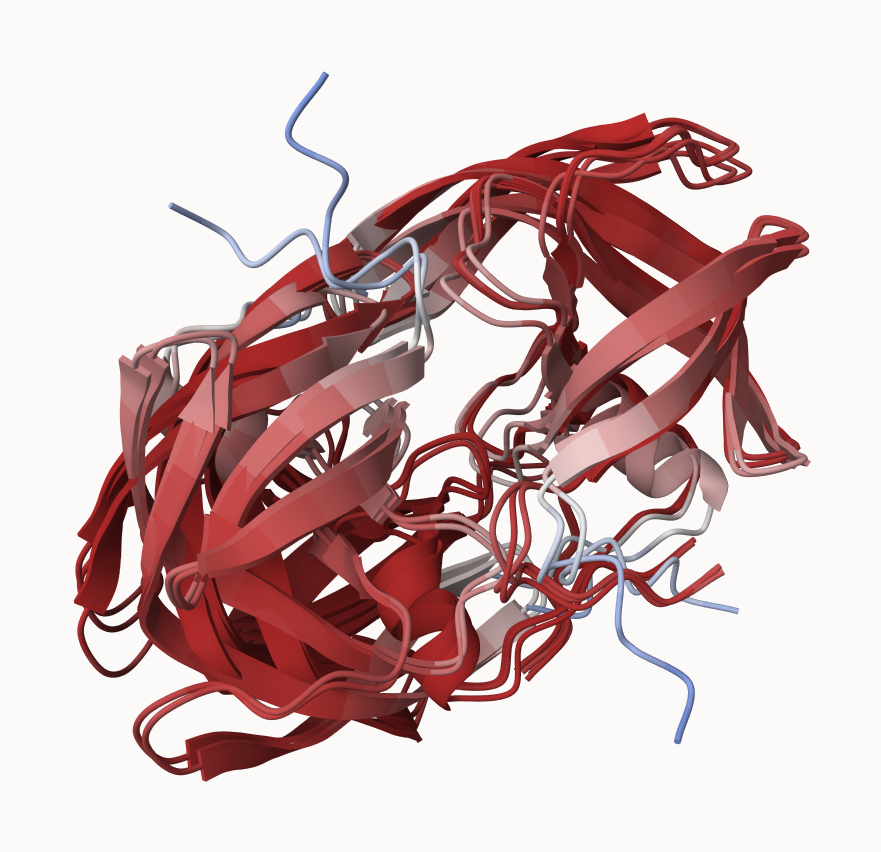
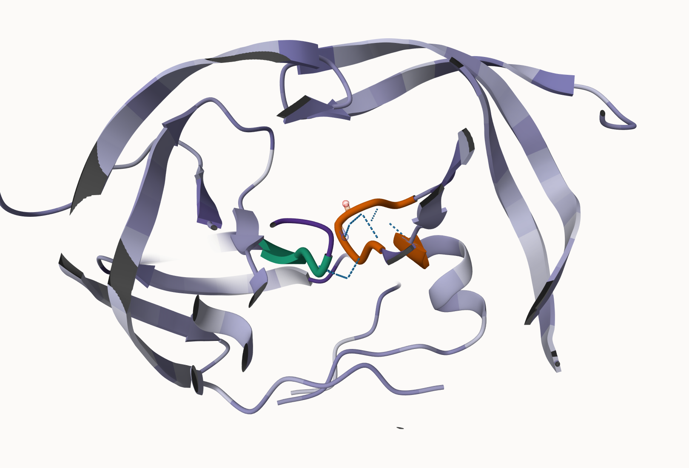

---
author:
- sylvia ho a18482382
authors:
- sylvia ho a18482382
title: class11
toc-title: Table of contents
---

:::: cell
``` {.r .cell-code}
results_dir <- "~/Downloads/HIVPrDimer_23119" 
pdb_files <- list.files(path=results_dir,
                        pattern="*.pdb",
                        full.names = TRUE)

# Print our PDB file names
basename(pdb_files)
```

::: {.cell-output .cell-output-stdout}
    [1] "HIVPrDimer_23119_unrelaxed_rank_001_alphafold2_multimer_v3_model_4_seed_000.pdb"
    [2] "HIVPrDimer_23119_unrelaxed_rank_002_alphafold2_multimer_v3_model_1_seed_000.pdb"
    [3] "HIVPrDimer_23119_unrelaxed_rank_003_alphafold2_multimer_v3_model_5_seed_000.pdb"
    [4] "HIVPrDimer_23119_unrelaxed_rank_004_alphafold2_multimer_v3_model_2_seed_000.pdb"
    [5] "HIVPrDimer_23119_unrelaxed_rank_005_alphafold2_multimer_v3_model_3_seed_000.pdb"
:::
::::

:::: cell
``` {.r .cell-code}
library(bio3d)

# Read all data from Models 
#  and superpose/fit coords
pdbs <- pdbaln(pdb_files, fit=TRUE, exefile="msa")
```

::: {.cell-output .cell-output-stdout}
    Reading PDB files:
    /Users/s/Downloads/HIVPrDimer_23119/HIVPrDimer_23119_unrelaxed_rank_001_alphafold2_multimer_v3_model_4_seed_000.pdb
    /Users/s/Downloads/HIVPrDimer_23119/HIVPrDimer_23119_unrelaxed_rank_002_alphafold2_multimer_v3_model_1_seed_000.pdb
    /Users/s/Downloads/HIVPrDimer_23119/HIVPrDimer_23119_unrelaxed_rank_003_alphafold2_multimer_v3_model_5_seed_000.pdb
    /Users/s/Downloads/HIVPrDimer_23119/HIVPrDimer_23119_unrelaxed_rank_004_alphafold2_multimer_v3_model_2_seed_000.pdb
    /Users/s/Downloads/HIVPrDimer_23119/HIVPrDimer_23119_unrelaxed_rank_005_alphafold2_multimer_v3_model_3_seed_000.pdb
    .....

    Extracting sequences

    pdb/seq: 1   name: /Users/s/Downloads/HIVPrDimer_23119/HIVPrDimer_23119_unrelaxed_rank_001_alphafold2_multimer_v3_model_4_seed_000.pdb 
    pdb/seq: 2   name: /Users/s/Downloads/HIVPrDimer_23119/HIVPrDimer_23119_unrelaxed_rank_002_alphafold2_multimer_v3_model_1_seed_000.pdb 
    pdb/seq: 3   name: /Users/s/Downloads/HIVPrDimer_23119/HIVPrDimer_23119_unrelaxed_rank_003_alphafold2_multimer_v3_model_5_seed_000.pdb 
    pdb/seq: 4   name: /Users/s/Downloads/HIVPrDimer_23119/HIVPrDimer_23119_unrelaxed_rank_004_alphafold2_multimer_v3_model_2_seed_000.pdb 
    pdb/seq: 5   name: /Users/s/Downloads/HIVPrDimer_23119/HIVPrDimer_23119_unrelaxed_rank_005_alphafold2_multimer_v3_model_3_seed_000.pdb 
:::
::::

::::: cell
``` {.r .cell-code}
rd <- rmsd(pdbs, fit=T)
```

::: {.cell-output .cell-output-stderr}
    Warning in rmsd(pdbs, fit = T): No indices provided, using the 198 non NA positions
:::

``` {.r .cell-code}
range(rd)
```

::: {.cell-output .cell-output-stdout}
    [1]  0.000 14.754
:::
:::::



::::: cell
``` {.r .cell-code}
library(pheatmap)

colnames(rd) <- paste0("m",1:5)
rownames(rd) <- paste0("m",1:5)
pheatmap(rd)
```

::: cell-output-display

:::

``` {.r .cell-code}
pdb <- read.pdb("1hsg")
```

::: {.cell-output .cell-output-stdout}
      Note: Accessing on-line PDB file
:::
:::::

::::: cell
``` {.r .cell-code}
core <- core.find(pdbs)
```

::: {.cell-output .cell-output-stdout}
     core size 197 of 198  vol = 9885.419 
     core size 196 of 198  vol = 6898.241 
     core size 195 of 198  vol = 1338.035 
     core size 194 of 198  vol = 1040.677 
     core size 193 of 198  vol = 951.865 
     core size 192 of 198  vol = 899.087 
     core size 191 of 198  vol = 834.733 
     core size 190 of 198  vol = 771.342 
     core size 189 of 198  vol = 733.069 
     core size 188 of 198  vol = 697.285 
     core size 187 of 198  vol = 659.748 
     core size 186 of 198  vol = 625.28 
     core size 185 of 198  vol = 589.548 
     core size 184 of 198  vol = 568.261 
     core size 183 of 198  vol = 545.022 
     core size 182 of 198  vol = 512.897 
     core size 181 of 198  vol = 490.731 
     core size 180 of 198  vol = 470.274 
     core size 179 of 198  vol = 450.738 
     core size 178 of 198  vol = 434.743 
     core size 177 of 198  vol = 420.345 
     core size 176 of 198  vol = 406.666 
     core size 175 of 198  vol = 393.341 
     core size 174 of 198  vol = 382.402 
     core size 173 of 198  vol = 372.866 
     core size 172 of 198  vol = 357.001 
     core size 171 of 198  vol = 346.576 
     core size 170 of 198  vol = 337.454 
     core size 169 of 198  vol = 326.668 
     core size 168 of 198  vol = 314.959 
     core size 167 of 198  vol = 304.136 
     core size 166 of 198  vol = 294.561 
     core size 165 of 198  vol = 285.658 
     core size 164 of 198  vol = 278.893 
     core size 163 of 198  vol = 266.773 
     core size 162 of 198  vol = 259.003 
     core size 161 of 198  vol = 247.731 
     core size 160 of 198  vol = 239.849 
     core size 159 of 198  vol = 234.973 
     core size 158 of 198  vol = 230.071 
     core size 157 of 198  vol = 221.995 
     core size 156 of 198  vol = 215.629 
     core size 155 of 198  vol = 206.8 
     core size 154 of 198  vol = 196.992 
     core size 153 of 198  vol = 188.547 
     core size 152 of 198  vol = 182.27 
     core size 151 of 198  vol = 176.961 
     core size 150 of 198  vol = 170.72 
     core size 149 of 198  vol = 166.128 
     core size 148 of 198  vol = 159.805 
     core size 147 of 198  vol = 153.775 
     core size 146 of 198  vol = 149.101 
     core size 145 of 198  vol = 143.664 
     core size 144 of 198  vol = 137.145 
     core size 143 of 198  vol = 132.523 
     core size 142 of 198  vol = 127.237 
     core size 141 of 198  vol = 121.579 
     core size 140 of 198  vol = 116.78 
     core size 139 of 198  vol = 112.575 
     core size 138 of 198  vol = 108.175 
     core size 137 of 198  vol = 105.137 
     core size 136 of 198  vol = 101.254 
     core size 135 of 198  vol = 97.379 
     core size 134 of 198  vol = 92.978 
     core size 133 of 198  vol = 88.188 
     core size 132 of 198  vol = 84.032 
     core size 131 of 198  vol = 81.902 
     core size 130 of 198  vol = 78.023 
     core size 129 of 198  vol = 75.276 
     core size 128 of 198  vol = 73.057 
     core size 127 of 198  vol = 70.699 
     core size 126 of 198  vol = 68.976 
     core size 125 of 198  vol = 66.707 
     core size 124 of 198  vol = 64.376 
     core size 123 of 198  vol = 61.145 
     core size 122 of 198  vol = 59.029 
     core size 121 of 198  vol = 56.625 
     core size 120 of 198  vol = 54.369 
     core size 119 of 198  vol = 51.826 
     core size 118 of 198  vol = 49.651 
     core size 117 of 198  vol = 48.19 
     core size 116 of 198  vol = 46.644 
     core size 115 of 198  vol = 44.748 
     core size 114 of 198  vol = 43.288 
     core size 113 of 198  vol = 41.089 
     core size 112 of 198  vol = 39.143 
     core size 111 of 198  vol = 36.468 
     core size 110 of 198  vol = 34.114 
     core size 109 of 198  vol = 31.467 
     core size 108 of 198  vol = 29.445 
     core size 107 of 198  vol = 27.323 
     core size 106 of 198  vol = 25.82 
     core size 105 of 198  vol = 24.149 
     core size 104 of 198  vol = 22.647 
     core size 103 of 198  vol = 21.068 
     core size 102 of 198  vol = 19.953 
     core size 101 of 198  vol = 18.3 
     core size 100 of 198  vol = 15.723 
     core size 99 of 198  vol = 14.841 
     core size 98 of 198  vol = 11.646 
     core size 97 of 198  vol = 9.435 
     core size 96 of 198  vol = 7.354 
     core size 95 of 198  vol = 6.181 
     core size 94 of 198  vol = 5.667 
     core size 93 of 198  vol = 4.706 
     core size 92 of 198  vol = 3.664 
     core size 91 of 198  vol = 2.77 
     core size 90 of 198  vol = 2.151 
     core size 89 of 198  vol = 1.715 
     core size 88 of 198  vol = 1.15 
     core size 87 of 198  vol = 0.874 
     core size 86 of 198  vol = 0.685 
     core size 85 of 198  vol = 0.528 
     core size 84 of 198  vol = 0.37 
     FINISHED: Min vol ( 0.5 ) reached
:::

``` {.r .cell-code}
core.inds <- print(core, vol=0.5)
```

::: {.cell-output .cell-output-stdout}
    # 85 positions (cumulative volume <= 0.5 Angstrom^3) 
      start end length
    1     9  49     41
    2    52  95     44
:::

``` {.r .cell-code}
xyz <- pdbfit(pdbs, core.inds, outpath="corefit_structures")
```
:::::

:::: cell
``` {.r .cell-code}
rf <- rmsf(xyz)

plotb3(rf, sse=pdb)
abline(v=100, col="gray", ylab="RMSF")
```

::: cell-output-display

:::
::::

::::::: cell
``` {.r .cell-code}
library(jsonlite)

# Listing of all PAE JSON files
pae_files <- list.files(path=results_dir,
                        pattern=".*model.*\\.json",
                        full.names = TRUE)


pae1 <- read_json(pae_files[1],simplifyVector = TRUE)
pae5 <- read_json(pae_files[5],simplifyVector = TRUE)

attributes(pae1)
```

::: {.cell-output .cell-output-stdout}
    $names
    [1] "plddt"   "max_pae" "pae"     "ptm"     "iptm"   
:::

``` {.r .cell-code}
head(pae1$plddt) 
```

::: {.cell-output .cell-output-stdout}
    [1] 90.81 93.25 93.69 92.88 95.25 89.44
:::

``` {.r .cell-code}
pae1$max_pae
```

::: {.cell-output .cell-output-stdout}
    [1] 12.84375
:::

``` {.r .cell-code}
pae5$max_pae
```

::: {.cell-output .cell-output-stdout}
    [1] 29.59375
:::
:::::::

::::: cell
``` {.r .cell-code}
plot.dmat(pae1$pae, 
          xlab="Residue Position (i)",
          ylab="Residue Position (j)",
          grid.col = "black",
          zlim=c(0,30))
```

::: cell-output-display

:::

``` {.r .cell-code}
plot.dmat(pae5$pae, 
          xlab="Residue Position (i)",
          ylab="Residue Position (j)",
          grid.col = "black",
          zlim=c(0,30))
```

::: cell-output-display

:::
:::::

:::::: cell
``` {.r .cell-code}
aln_file <- list.files(path=results_dir,
                       pattern=".a3m$",
                        full.names = TRUE)
aln_file
```

::: {.cell-output .cell-output-stdout}
    [1] "/Users/s/Downloads/HIVPrDimer_23119/HIVPrDimer_23119.a3m"
:::

``` {.r .cell-code}
aln <- read.fasta(aln_file[1], to.upper = TRUE)
```

::: {.cell-output .cell-output-stdout}
    [1] " ** Duplicated sequence id's: 101 **"
    [2] " ** Duplicated sequence id's: 101 **"
:::

``` {.r .cell-code}
dim(aln$ali)
```

::: {.cell-output .cell-output-stdout}
    [1] 5397  132
:::
::::::

:::: cell
``` {.r .cell-code}
sim <- conserv(aln)

plotb3(sim[1:99], sse=trim.pdb(pdb, chain="A"),
       ylab="Conservation Score")
```

::: cell-output-display

:::
::::

:::: cell
``` {.r .cell-code}
con <- consensus(aln, cutoff = 0.9)
con$seq
```

::: {.cell-output .cell-output-stdout}
      [1] "-" "-" "-" "-" "-" "-" "-" "-" "-" "-" "-" "-" "-" "-" "-" "-" "-" "-"
     [19] "-" "-" "-" "-" "-" "-" "D" "T" "G" "A" "-" "-" "-" "-" "-" "-" "-" "-"
     [37] "-" "-" "-" "-" "-" "-" "-" "-" "-" "-" "-" "-" "-" "-" "-" "-" "-" "-"
     [55] "-" "-" "-" "-" "-" "-" "-" "-" "-" "-" "-" "-" "-" "-" "-" "-" "-" "-"
     [73] "-" "-" "-" "-" "-" "-" "-" "-" "-" "-" "-" "-" "-" "-" "-" "-" "-" "-"
     [91] "-" "-" "-" "-" "-" "-" "-" "-" "-" "-" "-" "-" "-" "-" "-" "-" "-" "-"
    [109] "-" "-" "-" "-" "-" "-" "-" "-" "-" "-" "-" "-" "-" "-" "-" "-" "-" "-"
    [127] "-" "-" "-" "-" "-" "-"
:::

``` {.r .cell-code}
m1.pdb <- read.pdb(pdb_files[1])
occ <- vec2resno(c(sim[1:99], sim[1:99]), m1.pdb$atom$resno)
write.pdb(m1.pdb, o=occ, file="m1_conserv.pdb")
```
::::


